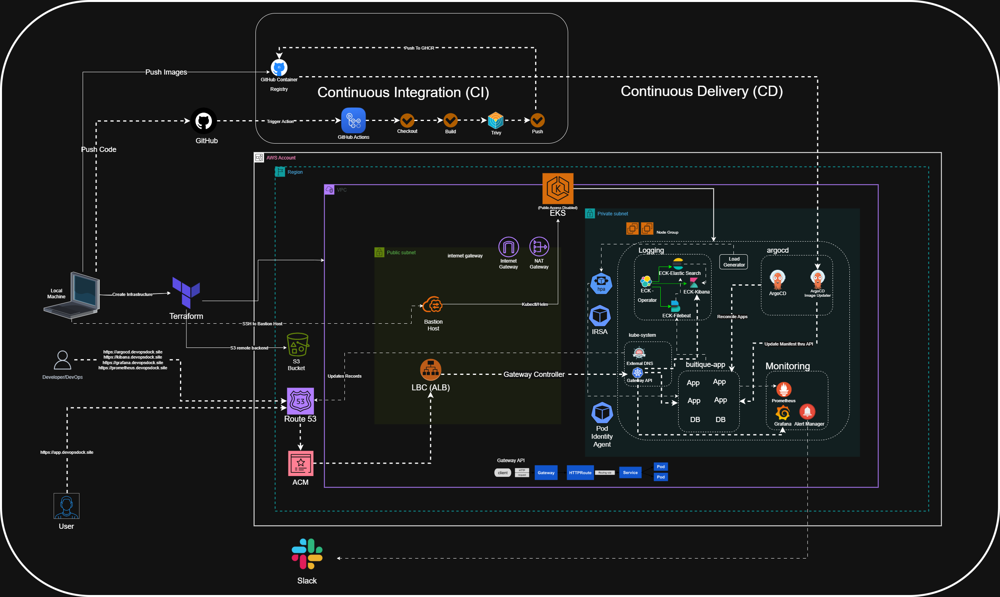

# devsecops-project_aws
## Architecture

The following diagram shows the overall GitOps-driven architecture of the project:

## Project Description

This repository demonstrates a production-grade, GitOps-driven microservices platform built on AWS EKS. It uses the Online Boutique application as a real-world microservices demo, where multiple services such as frontend, cart, checkout, payment, shipping, product catalog, recommendation, currency, email, ad service, and load generator work together to simulate an e-commerce platform.

The main goal of this project is not only to deploy a microservices application, but to build a complete cloud-native delivery platform around it. The project covers infrastructure provisioning, Kubernetes deployment, CI/CD automation, GitOps delivery, networking, DNS automation, observability, logging, and autoscaling.

Infrastructure is provisioned using Terraform, which creates the AWS networking and EKS cluster resources. Application delivery is managed through Argo CD, following GitOps principles where the Git repository acts as the single source of truth. Any change committed to Git is automatically reconciled and applied to the Kubernetes cluster by Argo CD.

The CI pipeline is implemented using GitHub Actions. When a microservice changes, the pipeline detects the updated service, builds a new Docker image, scans it with Trivy, and pushes the image to GitHub Container Registry. Argo CD Image Updater then detects the latest image tag and updates the running application automatically, enabling a complete CI/CD workflow.

For external access, the project uses AWS Load Balancer Controller with Kubernetes Gateway API. ExternalDNS integrates with Route 53 to automatically manage DNS records for services such as the application frontend, Argo CD, Grafana, Prometheus, and Kibana.

The platform also includes a full observability stack. Prometheus and Grafana are used for metrics and monitoring, Alertmanager sends alerts to Slack, and Elasticsearch, Filebeat, and Kibana provide centralized logging. Horizontal Pod Autoscaler is configured to validate scaling behavior under load using the load generator service.

Overall, this project represents an end-to-end DevOps and platform engineering implementation for running microservices on Kubernetes in a production-style environment.